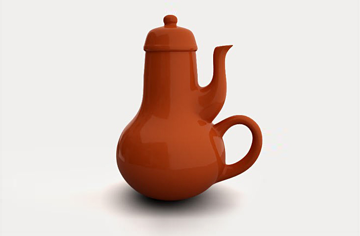

# Standards
* Understand the theory and goal of good UX design
* Be mindful of UX as you make UI decisions in your app
* Learn awareness of common patterns and trends in mobile experiences

# Objectives
Students will be able to:
* Explain difference between UX and UI
* Know designers and developers roles and responsibility in app UX
* Create a microinteraction checklist for yourself and your designer

# Resources
* [Microinteractions overview](https://uxplanet.org/microinteractions-the-secret-to-great-app-design-4cfe70fbaccf#.1gqox8hp8)
* [iOS Human Interface Guidelines](https://developer.apple.com/ios/human-interface-guidelines/)
* [Google Material Design Spec](https://material.google.com)

# Great UX Books
* [Don't Make Me Think (Steve Krug)](https://www.amazon.com/Dont-Make-Think-Revisited-Usability/dp/0321965515)
* [Design of Everyday Things (Don Norman)](https://www.amazon.com/Design-Everyday-Things-Revised-Expanded/dp/0465050654/ref=pd_sbs_14_t_0?ie=UTF8&psc=1&refRID=WHGSVYASX57DP7FZ4WDN)
  Don Norman was a designer at Apple!

# What is Good UX?
According to DMMT, if something is usable, it means that
> a person of average (or even below average) ability and experience can figure out how to use the thing to accomplish something without it being more trouble than it's worth. -Steve Krug

I like to put it this way: good UX means that
> every part of an app should always do exactly what the user expects it to do. This will make the user very happy indeed.

## Clarity Trumps Consistency (Apple's Law)
> If you can make something _significantly_ clearer by making it slightly inconsistent, choose in favor of clarity.

## Krug's UX law #2
> It doesn't matter how many times I have to click, as long as each click is a mindless, unambiguous choice.

# UX Terminology: Affordances and Microinteractions
* A doorknob is a great example of an "affordance"
* So is a light switch
* The affordance is what makes it recognizable as a door knob or lightswitch
* Bad affordances:
  * [hobbit door](https://depictedspark.files.wordpress.com/2012/09/bag-end.jpg)
    Poor placement makes it hard to find, harder to operate
  * [gesture light](https://www.youtube.com/watch?v=D8sgtn7UX9g&feature=youtu.be&t=50)
    Lack of visible controls or recognizable binary state makes it hard to identify as light switch
* Good affordances (delightful microinteractions):
  * All of these are still recognizable as handles or switches, perform the operation expected, and also leave user with memorable and unique experiences
  * [weird door knobs](https://www.google.com/search?q=weird+door+knob&espv=2&biw=1238&bih=676&source=lnms&tbm=isch&sa=X&ved=0ahUKEwj6wYS2xq7PAhWNQD4KHXJcC2wQ_AUIBygC)
  * [push-button light switch](https://www.youtube.com/watch?v=7kIohdYWk0Q)
  * [water valve light switch](https://www.youtube.com/watch?v=Uvv3tTiz6hw)

# Microinteractions are where you can add "delight"
> Delightful apps usually come from marrying an idea about something people would really enjoy being able to do, but don't imagine is possible, with a bright idea about how to use some new technology to accomplish it. -Don't Make me Think

Those are big words. The newest thinking is pointing to the smallest parts of your app as contributing the most to UX.

## Microinteraction examples:
* AirBnb: transition from listing to detail
* Harvest: badge animation when I click on the "today" button and I'm already on today
* Evernote: transition from home screen to Notebooks
* Evernote: "step-wise" animations for search mode transition
* Today: blurred background to show modal layering
* Today: "step-wise" animations for goal check-ins
* Seamless: add to bag animation
* Seamless: edit bag items interaction
* Wunderlist: table view row partial gesture interaction (vs. T-mobile)
* Hotel Tonight: transition from listing to detail (too many things moving)
* Hipmunk: destination search results include "beach"
* Podcasts: when I plug in my headphones, my phone suggests podcasts

## Microinteraction Do's
* Let users make mistakes, but make it easy to recover from errors
* Use animation to guide actions
* Show progress, load incrememntally
* Use search results, messaging, data in general to delight
* Remember common behavior and make suggestions

## Microinteraction Dont's
* Put "sizzle" in the way of features (T-mobile)
* Make animation so fast/erratic that users can't see what's going on (Hotel Tonight)
* Have a lot of blank screen moments
* Use unexpected affordances (Harvest delete)
* Make assumptions that could have negative consequences (favoriting on Wunderlist)

# Microinteraction Design Checklist Example
For each screen
* How do I get back?
* What are intro/outro transitions?
* What happens if I rotate the screen?
* What does left/right gesture do?

For table views
* What does left/right gesture do?
* How does row gesture affect other rows?
* Behavior on scrolling past the top/bottom